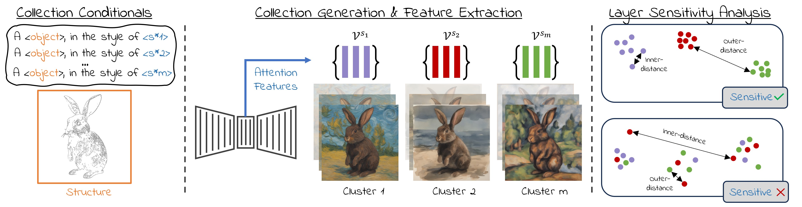

<h1 align="center">
  [CVPR 25] Conditional Balance:  <br>
  Improving Multi-Conditioning Trade-Offs in Image Generation <br>
  Model Analysis Repository
</h1>

<p align='center'>
<a href="https://nadavc220.github.io/conditional-balance.github.io/"></a>
<a href="https://www.youtube.com/watch?v=WNRcC-fLXq8"></a>
<a href="https://arxiv.org/abs/2412.19853"></a>
<a href="https://pytorch.org/">=2.4.1-Red?logo=pytorch"></a>
</p>


This is the official repository of the model analysis method presented in our paper "Conditional Balance: Improving Multi-Conditioning Trade-Offs in Image Generation" by Nadav Z. Cohen, Oron Nir, and Ariel Shamir.

If you are looking for the inference code, click the following link: [Inference Code](https://github.com/Nadavc220/conditional-balance).




# Environment Setup
Please follow enviornemt setup as presented in our main repo: [Inference Code](https://github.com/Nadavc220/conditional-balance).


# Model Analysis
Every experiment runs two steps as presented in the paper:

### 1) Image Series Generation
The conditionals for the image series are defined in the analysis_files folder. We share an example for using the rabbit in the texture analysis and the cat/wolf in the geometry analysis. Each experiment uses it's own script as they run a bit differently.

During this step, the self attention features are gathered for the next step.
```
### Texture Script
python extract_layers_statistics.py --series_name style_analysis_texture_rabbit \
                                    --content_file content_texture_rabbit.yaml \
                                    --style_file style_prompts_texture.yaml 

### Geometry Script
python style_gen_img.py --series_name style_analysis_geometry_cat \
                        --subject cat
```

### 2) Layer Grading
After we gathered the layer statistics in step 1, it's time to grade their sensitivity. This can be done by calling the grade_layers_jsd.py file with out series name:

```
python grade_layers_jsd.py --series_name style_analysis_texture_rabbit
```
Note that this step is the same for both experiments, but you need to make sure you are using the same series name for both steps.

### 3) Grading Combination (Optional)
In our paper, we combined experiments gradings to get a more robust result. If you wish to do so too, you can use the "combine_grading.py" file.

# Citation
If you found this project helpful in your research, please consider citing our paper.
```
@InProceedings{Cohen_2025_CVPR,
    author    = {Cohen, Nadav Z. and Nir, Oron and Shamir, Ariel},
    title     = {Conditional Balance: Improving Multi-Conditioning Trade-Offs in Image Generation},
    booktitle = {Proceedings of the Computer Vision and Pattern Recognition Conference (CVPR)},
    month     = {June},
    year      = {2025},
    pages     = {2641-2650}
}
```
```
@misc{cohen2024conditionalbalanceimprovingmulticonditioning,
      title={Conditional Balance: Improving Multi-Conditioning Trade-Offs in Image Generation}, 
      author={Nadav Z. Cohen and Oron Nir and Ariel Shamir},
      year={2024},
      eprint={2412.19853},
      archivePrefix={arXiv},
      primaryClass={cs.CV},
      url={https://arxiv.org/abs/2412.19853}, 
}
```

# Acknowledgments
We wish to thank the authors of [StyleAligned](https://github.com/google/style-aligned) as parts of our code were adopted from their repository.